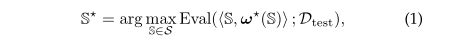
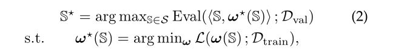
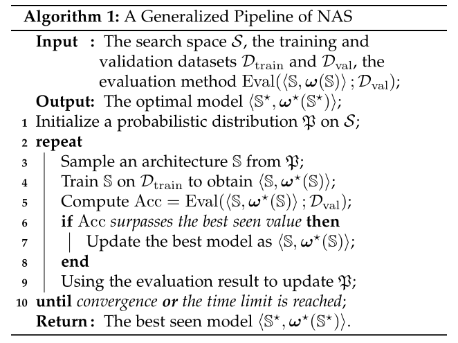
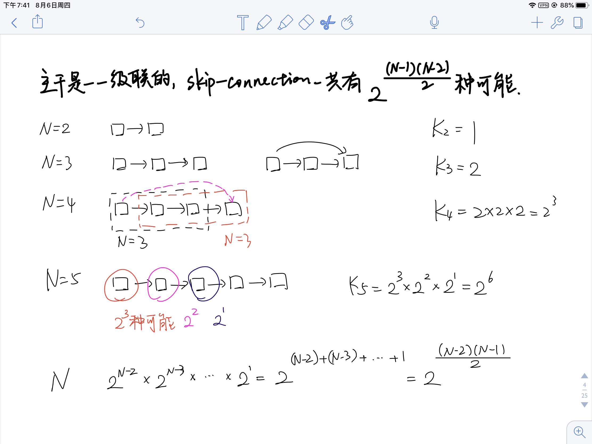
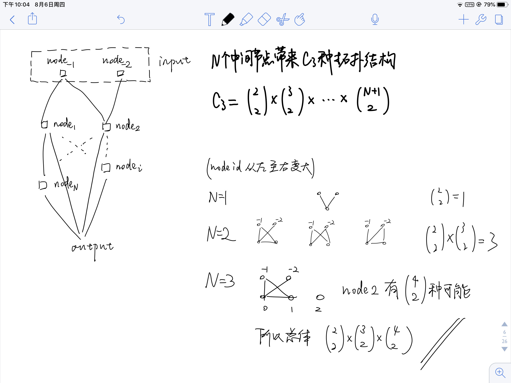

《Weight-Sharing Neural Architecture Search: A Battle to Shrink the Optimization Gap》(2020, 一作 Lingxi Xie ) 代码笔记。  

# 1 INTRODUCTION

权重共享网络架构搜索：同时从 super-net 中筛选合适的子网络以及子网络的参数。

将权重共享网络架构搜索按照 “搜索空间建模” 和 “搜索策略算法” 分为两大类。

# 2 NAS

## 2.1 Overall Framework

NAS 的理想目标函数是：

实际的目标函数是：找到一个子网络S使得参数w\*在训练集上loss最小，并且S在所有子网络中验证集accuracy最高。

传统NAS算法伪代码：

## 2.2 Search Space

### 2.2.1 The EvoNet Search Space

> [18] E. Real, S. Moore, A. Selle, S. Saxena, Y. L. Suematsu, J. Tan, Q. V. Le, and A. Kurakin, “Large-scale evolution of image classifiers,” in International Conference on Machine Learning, 2017. **(EvoNet)**
>
> [42] H. Liu, K. Simonyan, O. Vinyals, C. Fernando, and K. Kavukcuoglu, “Hierarchical representations for efficient architecture search,” in International Conference on Learning Representations, 2018.
>
> [43] L. Wang, S. Xie, T. Li, R. Fonseca, and Y. Tian, “Sample efficient neural architecture search by learning action space,” arXiv preprint arXiv:1906.06832, 2019.
>
> [44] E. Real, C. Liang, D. R. So, and Q. V. Le, “Automl-zero: Evolving machine learning algorithms from scratch,” arXiv preprint arXiv:2003.03384, 2020.

此类工作研究的是完全开放的搜索空间，cell number / cell connections / cell components 等网络结构约束条件一概没有，搜索空间被定义为是 a set of actions on the architecture, e.g., inserting/removing a convolutional layer to a specific position, altering the kernel size of a convolutional layer, adding/deleting a skip connection between two layers 等等。

完全开放的搜索空间是未来的研究趋势，目前存在的挑战是缺少 robust search strategy。

### 2.2.2 The NAS-RL Search Space

> [19] L. Xie and A. Yuille, “Genetic cnn,” in International Conference on Computer Vision, 2017.
>
> [20] B. Zoph and Q. V. Le, “Neural architecture search with reinforcement learning,” in International Conference on Learning Representations, 2017.

此类工作搜索的是 densely-connected macro architecture，存在
$$
2^{(N−1)(N−2)/2}
$$
种可能。这么来的：

假设每个 cell 里可以有 C 种 operator 的组合方法（包括  filter height, filter width, stride height, stride width, the number of filters），所以全部的搜索空间中有：
$$
C^N \cdot 2^{(N−1)(N−2)/2}
$$
种可能。

### 2.2.3 The NASNet Search Space

> [25] H. Liu, K. Simonyan, and Y. Yang, “Darts: Differentiable architecture search,” in International Conference on Learning Representations, 2019.
>
> [45] B. Zoph, V. Vasudevan, J. Shlens, and Q. V. Le, “Learning transferable architectures for scalable image recognition,” in Computer Vision and Pattern Recognition, 2018.
>
> [46] C. Liu, B. Zoph, M. Neumann, J. Shlens, W. Hua, L.-J. Li, L. FeiFei, A. Yuille, J. Huang, and K. Murphy, “Progressive neural architecture search,” in European Conference on Computer Vision, 2018.
>
> [47] E. Real, A. Aggarwal, Y. Huang, and Q. V. Le, “Regularized evolution for image classifier architecture search,” in AAAI Conference on Artificial Intelligence, 2019.

此类工作假设所有的cell都是相同结构，所以只需要搜索cell内部的operator即可，对应笔记2.2图中的 micro-NAS。假设输入是两个节点（index 为 -2 -1）而其余的N个节点可分为 C1个 connection node ( dil-conv-3x3空洞卷积, sep-conv-5x5分组卷积, identity, max-pool-3x3 ) 和 C2 个 summarization function node ( sum, concat, product )。最重要的约束条件是 **Each hidden node is connected to two nodes with smaller indices**  以及 **The outputs of all intermediate nodes are concatenated into the output of the cell**。 

假设一个 cell 里有 C3 topologies，意味着：
$$
C_3 = 
\bigl(
    \begin{smallmatrix}
		2\\2
	\end{smallmatrix}
\bigr) \times
\bigl(
    \begin{smallmatrix}
		3\\2
	\end{smallmatrix}
\bigr) \times
... \times
\bigl(
    \begin{smallmatrix}
		N+1\\2
	\end{smallmatrix}
\bigr)
$$
这么来的：

所以 cell 内部结构总共有：
$$
(C_1^2 \times C_2)^N \times C_3
$$
种可能。

这么来的： 

### 2.2.4 The DARTS Search Space

