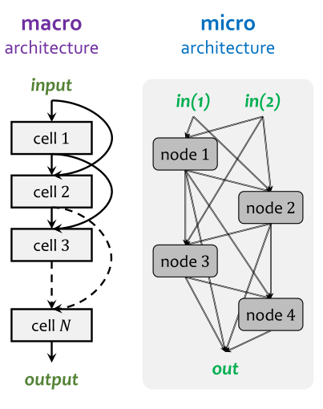
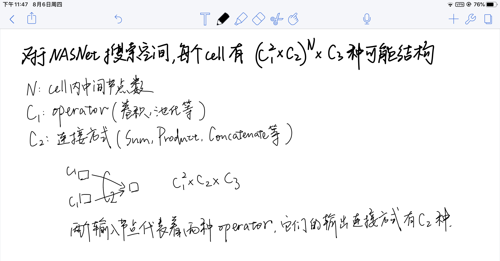
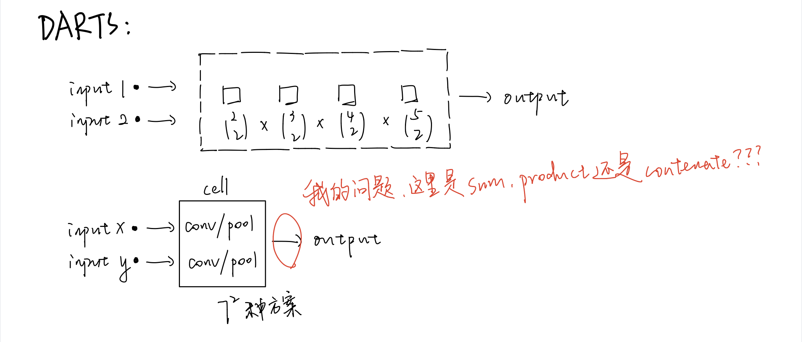
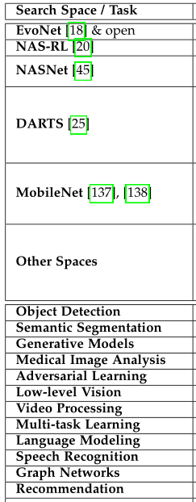
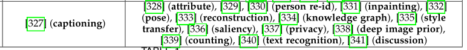

《Weight-Sharing Neural Architecture Search: A Battle to Shrink the Optimization Gap》(2020, 一作 Lingxi Xie ) 代码笔记。  

# 1 INTRODUCTION

权重共享网络架构搜索：同时从 super-net 中筛选合适的子网络以及子网络的参数。

将权重共享网络架构搜索按照 “搜索空间建模” 和 “搜索策略算法” 分为两大类。

# 2 NAS

## 2.1 Overall Framework

NAS 的理想目标函数是：

实际的目标函数是：找到一个子网络S使得参数w\*在训练集上loss最小，并且S在所有子网络中验证集accuracy最高。

传统NAS算法伪代码：

## 2.2 Search Space

### 2.2.1 The EvoNet Search Space

> [18] E. Real, S. Moore, A. Selle, S. Saxena, Y. L. Suematsu, J. Tan, Q. V. Le, and A. Kurakin, “Large-scale evolution of image classifiers,” in International Conference on Machine Learning, 2017. **(EvoNet)**
>
> [42] H. Liu, K. Simonyan, O. Vinyals, C. Fernando, and K. Kavukcuoglu, “Hierarchical representations for efficient architecture search,” in International Conference on Learning Representations, 2018.
>
> [43] L. Wang, S. Xie, T. Li, R. Fonseca, and Y. Tian, “Sample efficient neural architecture search by learning action space,” arXiv preprint arXiv:1906.06832, 2019.
>
> [44] E. Real, C. Liang, D. R. So, and Q. V. Le, “Automl-zero: Evolving machine learning algorithms from scratch,” arXiv preprint arXiv:2003.03384, 2020.

此类工作研究的是完全开放的搜索空间，cell number / cell connections / cell components 等网络结构约束条件一概没有，搜索空间被定义为是 a set of actions on the architecture, e.g., inserting/removing a convolutional layer to a specific position, altering the kernel size of a convolutional layer, adding/deleting a skip connection between two layers 等等。

完全开放的搜索空间是未来的研究趋势，目前存在的挑战是缺少 robust search strategy。

### 2.2.2 The NAS-RL Search Space

> [19] L. Xie and A. Yuille, “Genetic cnn,” in International Conference on Computer Vision, 2017.
>
> [20] B. Zoph and Q. V. Le, “Neural architecture search with reinforcement learning,” in International Conference on Learning Representations, 2017.

此类工作搜索的是 densely-connected macro architecture，存在
$$
2^{(N−1)(N−2)/2}
$$
种可能。这么来的：

假设每个 cell 里可以有 C 种 operator 的组合方法（包括  filter height, filter width, stride height, stride width, the number of filters），所以全部的搜索空间中有：
$$
C^N \cdot 2^{(N−1)(N−2)/2}
$$
种可能。

### 2.2.3 The NASNet Search Space

> [25] H. Liu, K. Simonyan, and Y. Yang, “Darts: Differentiable architecture search,” in International Conference on Learning Representations, 2019.
>
> [45] B. Zoph, V. Vasudevan, J. Shlens, and Q. V. Le, “Learning transferable architectures for scalable image recognition,” in Computer Vision and Pattern Recognition, 2018.
>
> [46] C. Liu, B. Zoph, M. Neumann, J. Shlens, W. Hua, L.-J. Li, L. FeiFei, A. Yuille, J. Huang, and K. Murphy, “Progressive neural architecture search,” in European Conference on Computer Vision, 2018.
>
> [47] E. Real, A. Aggarwal, Y. Huang, and Q. V. Le, “Regularized evolution for image classifier architecture search,” in AAAI Conference on Artificial Intelligence, 2019.

此类工作假设所有的cell都是相同结构，所以只需要搜索cell内部的operator即可，对应笔记2.2图中的 micro-NAS。假设输入是两个节点（index 为 -2 -1）而其余的N个节点可分为 C1个 connection node ( dil-conv-3x3空洞卷积, sep-conv-5x5分组卷积, identity, max-pool-3x3 ) 和 C2 个 summarization function node ( sum, concat, product )。最重要的约束条件是 **Each hidden node is connected to two nodes with smaller indices**  以及 **The outputs of all intermediate nodes are concatenated into the output of the cell**。 

假设一个 cell 里有 C3 topologies，意味着：
$$
C_3 = 
\bigl(
    \begin{smallmatrix}
		2\\2
	\end{smallmatrix}
\bigr) \times
\bigl(
    \begin{smallmatrix}
		3\\2
	\end{smallmatrix}
\bigr) \times
... \times
\bigl(
    \begin{smallmatrix}
		N+1\\2
	\end{smallmatrix}
\bigr)
$$
这么来的：

所以 cell 内部结构总共有：
$$
(C_1^2 \times C_2)^N \times C_3
$$
种可能。

这么来的每个输入都需要经过一个运算符得到一组特征，该运算符有C1种可能： 

### 2.2.4 The DARTS Search Space

> [27] K. Bi, L. Xie, X. Chen, L. Wei, and Q. Tian, “Gold-nas: Gradual, one-level, differentiable,” arXiv preprint arXiv:2007.03331, 2020. **这是 Lingxi Xie 在 VALSE2020 提到的工作**
>
> [48] A. Zela, T. Elsken, T. Saikia, Y. Marrakchi, T. Brox, and F. Hutter, “Understanding and robustifying differentiable architecture search,” in International Conference on Learning Representations, 2020.
>
> [49] H. Zhou, M. Yang, J. Wang, and W. Pan, “Bayesnas: A bayesian approach for neural architecture search,” in International Conference on Machine Learning, 2019.
>
> [50] M. Cho, M. Soltani, and C. Hegde, “One-shot neural architecture search via compressive sensing,” arXiv preprint arXiv:1906.02869, 2019.
>
> [51] L. Wang, L. Xie, T. Zhang, J. Guo, and Q. Tian, “Scalable nas with factorizable architectural parameters,” arXiv preprint arXiv:1912.13256, 2019.
>
> [52] K. Bi, C. Hu, L. Xie, X. Chen, L. Wei, and Q. Tian, “Stabilizing darts with amended gradient estimation on architectural parameters,” arXiv preprint arXiv:1910.11831, 2019.

C1 有 7 种选择方案。引入了一个  dummy-zero operator 参与搜索，但是不会出现在最终的 architecture 内。

>sep-conv-3x3, sep-conv-5x5, dil-conv-3x3, dil-conv-5x5, max-pool-3x3, avg-pool-3x3, skip-connect

为了让架构搜索更容易 differentiable，每层的输入数据可以来自前层输出的任意两个。

> ”To ease the formulation of differentiable architecture search, each layer receives input data from an arbitrary number of previous layers in the same cell though only two of them are allowed to survive.“

接下来作者给出了一道计算题：

Provided that 4 intermediate cells are present, the number of architectures for both the normal and reduction cells is
$$
\bigl(
    \begin{smallmatrix}
		2\\2
	\end{smallmatrix}
\bigr) \times
\bigl(
    \begin{smallmatrix}
		3\\2
	\end{smallmatrix}
\bigr) \times
\bigl(
    \begin{smallmatrix}
		4\\2
	\end{smallmatrix}
\bigr) \times
\bigl(
    \begin{smallmatrix}
		5\\2
	\end{smallmatrix}
\bigr) \times 7^8 
\approx 1.0 \times 10^9
$$
这么来的：

and the entire space has around
$$
1.1 \times 10^{18}
$$
architectures.

这个数怎么来的我就不知道了，可能得看一下原论文。

### 2.2.5 The MobileNet Search Space

> [139] M. Tan, B. Chen, R. Pang, V. Vasudevan, M. Sandler, A. Howard, and Q. V. Le, “Mnasnet: Platform-aware neural architecture search for mobile,” in Computer Vision and Pattern Recognition, 2019.
>
> [143] M. Tan and Q. V. Le, “Efficientnet: Rethinking model scaling for convolutional neural networks,” in International Conference on Machine Learning, 2019.
>
> [144] X. Chu, B. Zhang, R. Xu, and J. Li, “Fairnas: Rethinking evaluation fairness of weight sharing neural architecture search,” arXiv preprint arXiv:1907.01845, 2019.
>
> [145] M. Tan and Q. V. Le, “Mixconv: Mixed depthwise convolutional kernels,” in British Machine Vision Conference, 2019.
>
> [151] J. Fang, Y. Sun, Q. Zhang, Y. Li, W. Liu, and X. Wang, “Densely connected search space for more flexible neural architecture search,” in Computer Vision and Pattern Recognition, 2020.
>
> [161] J. Mei, Y. Li, X. Lian, X. Jin, L. Yang, A. Yuille, and J. Yang, “Atomnas: Fine-grained end-to-end neural architecture search,” in International Conference on Learning Representations, 2020.
>
> [162] S. Chen, Y. Chen, S. Yan, and J. Feng, “Efficient differentiable neural architecture search with meta kernels,” arXiv preprint arXiv:1912.04749, 2019.
>
> [170] Y. Li, X. Jin, J. Mei, X. Lian, L. Yang, C. Xie, Q. Yu, Y. Zhou, S. Bai, and A. L. Yuille, “Neural architecture search for lightweight non-local networks,” in Computer Vision and Pattern Recognition, 2020.
>
> [173] R. Guo, C. Lin, C. Li, K. Tian, M. Sun, L. Sheng, and J. Yan, “Powering one-shot topological nas with stabilized share-parameter proxy,” in European Conference on Computer Vision, 2020.
>
> [343] A. Howard, M. Sandler, G. Chu, L.-C. Chen, B. Chen, M. Tan, W. Wang, Y. Zhu, R. Pang, V. Vasudevan et al., “Searching for mobilenetv3,” in Computer Vision and Pattern Recognition, 2019.

cell 数固定，但是 cell 之间的 skip-connection 被取消，参考 MobileNet V1 只保留单链，但是 cell 内部的 layer number 是可以被搜索的。

### 2.2.6 Other Search Spaces

Table 1 提到了不同任务的NAS方法，但似乎都是2D-CNN的。

## 2.3 Search Strategy and Evaluation Method