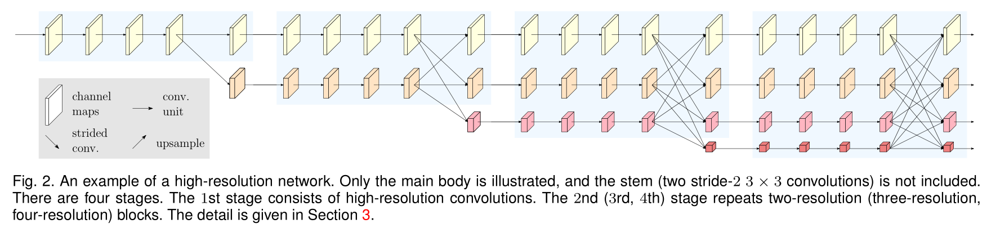

Deep High-Resolution Representation Learning for Visual Recognition (CVPR2019)

# Abstract

本文提出 High-Resolution Network (HRNet)，不同于以往的“高分辨率-卷积网络编码为低分辨率-恢复为高分辨率”，而是在模型中保持高分辨率。HRNet 有以下两种特性：(i) Connect the high-to-low resolution convolution streams in parallel; (ii) Repeatedly exchange the information across resolutions。这样做的好处是通过高分辨率保留了更多的语义信息（semantically richer and spatially more precise）。本工作在 human pose estimation, semantic segmentation, 和 object detection 均实现了 SOTA。

# 1. INTRODUCTION

Fig. 1 是常见的“高分辨率-低分辨率-高分辨率”模型结构。Fig. 2 是HRNet。

涨点的两个方面：

- Connect the high-to-low resolution convolution streams in parallel：不像U-Net 一样是U型架构，本工作一直保持高分辨率的 feature map，让特征提取并行进行。高分辨率特征图意味着更多的语义信息。
- Repeatedly exchange the information across resolutions：对于不同分辨率的特征图采用 multi-resolution fusion 的方式，从而交互各级语义信息。

提供了 HRNet 的两个版本：

- HRNet-V1: 只输出高分辨率特征图输出（Fig 2 第一行），应用在了COCO关键点检测任务中。

  > We empirically demonstrate the superior pose estimation performance on the COCO keypoint detection dataset.

- HRNet-V2: combines the representations from all the high-to-low resolution parallel streams. 各分辨率下所有特征图输出（Fig 2 全部），应用在了各语义分割任务。

  > The proposed approach achieves state-of-the-art results on PASCAL-Context, Cityscapes, and LIP with similar model sizes and lower computation complexity. 

第七章消融实验证明了 HRNet-V2 结果远超过 HRNet-V1。

另外，还提供了一个版本 HRNet-V2p，其实就是只输出 HRNet-V2 高分辨率特征图输出，作为其它算法（state-of-the-art detection frameworks, including Faster R-CNN, Cascade R-CNN [12], FCOS [136], and CenterNet [36], and state-of-the-art joint detection and instance segmentation frameworks, including Mask R-CNN [53], Cascade Mask R-CNN, and Hybrid Task Cascade [16].）的 backbone architecture。

实验结果：

- We observe similar performance for **HRNet-V1 and HRNet-V2** over COCO pose estimation, and the superiority of HRNet-V2 to HRNet-V1 in semantic segmentation.

  > *我的问题：为什么在COCO上差别不大但是语义分割上差别较大呢？*

- The results show that **HRNet-V2p** gets detection performance improvement and in particular dramatic improvement for small objects.

# 2. RELATED WORK (略)

- low-resolution representation learning

- high-resolution representation recovering

- high-resolution representation maintaining

- multi-scale fusion

# 3. HIGH -RESOLUTION NETWORKS

## 3.1 Parallel Multi-Resolution Convolutions

$$
N_{sr}:=  \text{a sub-stream in the } s \text{ th stage and } r \text{ is the resolution index}
$$

resolution index 和 resolution 的关系是：
$$
\frac{1}{2^{r-1}}
$$

## 3.2 Repeated Multi-Resolution Fusions

通过 stride 下采样，通过双线性上采样。

## 3.3 Representation Head

## 3.4 Instantiation/Implementation (略)

## 3.5 Analysis

(a) 的并行类似分组卷积。**除了参数量降低以及提高并行化以外，分组卷积的优势在于精度的提升**，https://blog.yani.io/filter-group-tutorial/ 该博客通过实验证明 「过滤器组 (filter group) 的作用就是学习通道维度上的块对角结构的稀疏性。 (The effect of filter groups is to learn with a *block-diagonal* structured sparsity on the channel dimension.) 在对过滤器进行了分组的网络中，高相关性的过滤器以更结构化的方式学习。(As can be seen in the correlation images, the *filters with high correlation* are learned in a more structured way in the networks with filter groups. In effect, filter relationships that don’t have to be learned are no longer parameterized.) 结果，不要求学习的过滤器关系也不再需要用参数进行表示，这就显著减少了网络中的参数数量，并且在减少参数的过程中不容易过度拟合，因此这种类似正则化的效果可以让优化器学习更准确、更有效的深度网络。」 

那么我们是否可以认为 HRNet 中为不同分辨率设计的并行 path 也隐含这样的分组思想呢？个人认为大可不必。如果这样做完全OK的话为什么在每个阶段末还要设计 fusion 的环节呢？

(b) 的融合类似传统2D卷积（如图c）。

# 4. HUMAN POSE ESTIMATION (实验略)

# 5. SEMANTIC SEGMENTATION (实验略)

# 6. COCO OBJECT DETECTION (实验略)

# 7. ABLATION STUDY

**Representations of different resolutions**:  The resolution does impact the keypoint prediction quality.

**Repeated multi-resolution fusion**

1. 首先消融实验了fusion对精度的影响: (a) W/o intermediate fusion units (1 fusion): There is no fusion between multi-resolution streams except the final fusion unit. (b) W/ across-stage fusion units (3 fusions): There is no fusion between parallel streams within each stage. (c) W/ both across-stage and within-stage fusion units (totally 8 fusions): This is our proposed method.

   

2. 其次消融实验了fusion的另外两种可能方案: (i) use bilinear downsample to replace strided convolutions; (ii) use the multiplication operation to replace the sum operation. 

   > In the former case, the COCO pose estimation AP score and the Cityscapes segmentation mIoU score are reduced to 72.6 and 74.2 . The reason is that downsampling reduces the volume size (width × height × #channels) of the representation maps, and strided convolutions learn better volume size reduction than bilinear downsampling.
   >
   > In the later case, the results are much worse: 54.7 and 66.0, respectively. The possible reason might be that multiplication increases the training difficulty as pointed in [145].

**Resolution maintenance**

Fig. 2 是本工作提出的网络结构，与此对应的消融实验网络结构是: 保证 fusion 位置相同，但是 **all the four high-to-low resolution streams are added at the beginning and the depths of the four streams are the same** (也就是说不是这种 hierarchical architecture, 而是四条相同长度的 paralleled path)。

在确保 FLOPs 和参数量差距不大的条件下，对两个模型 train-from-scratch，Fig. 2 在 COCO 验证集的精度更高。作者给出的理由是 the low-level features extracted from the early stages over the low-resolution streams are less helpful.

# 8. CONCLUSIONS

在 MXNet 开发框架内，HRNet 的 memory cost 与 SOTA 模型相比差距不大。

