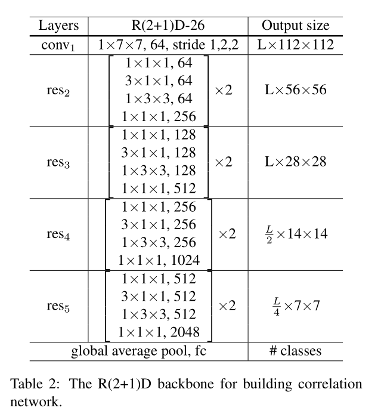

Video Modeling with Correlation Networks (CVPR2020)

# 1. Introduction

视频数据包含空间信息 (appearance information) 和时序信息 (motion information)，二者都可通过卷积神经网络进行特征提取。Motion 往往可以通过光流图和3D卷积滤波器获取。

> CNNs for video analysis have been extended with the capability of capturing not only appearance information contained in individual frames but also motion information extracted from the temporal dimension of the image sequence.

本工作提出的 **协关系算子 (correlation operator)** 受到了 FlowNet 的启发，在 FlowNet 中作者提出了一个称为 correlation layer 的模块，该模块可以将视频信息从RGB域 (RGB pixel space) 转换为Motion域 (motion displacement space)。本工作提出的 correlation operator 学习的是不同卷积层间特征图的相似关系，从而得到 motion 信息（特指相邻帧的匹配关系，即 the matching of adjacent frames）。

> Flownet: Learning optical flow with convolutional networks. In ICCV,2015.
>
> We propose a learnable correlation operator to establish frame-to-frame matches over convolutional feature maps to capture different notions of similarity in different layers of the network. 

与3D卷积相比较，我们的方案与双流网络的实现原理相同，在单个模型中分解了空间信息与时序信息的计算 (factorizes the computation of appearance and motion)，习得的滤波器存在明显不同。

> Compared to 3D CNNs, which extract spatio-temporal features, our model factorizes the computation of appearance and motion, and learns distinct filters capturing different measures of patch similarity. The learned filters can match pixels moving in different directions. 
>
> *我的问题：“patch similarity” 是什么？*

实验表明，我们的方案：

- compares favorably with widely-used 3D CNNs for video modeling
- achieves competitive results over the prominent two-stream network while being much faster to train. 

# 2. Related Work

## Architectures for video classification

双流网络的研究方向：

- adding connections between the two streams
- inflating a 2D model to 3D

3D卷积神经网络的研究方向：

- 直接将图像领域的SOTA网络复刻到视频领域中
- 把3D卷积解耦为2D空间卷积 (2D spatial convolution) 和1D时间域卷积 (1D temporal convolution)

## Motion information for action recognition

> Besides two-stream networks and 3D CNNs, ActionFlowNet [39] proposes to jointly estimate optical flow and recognize actions in one network. Fan et al. [12] and Piergiovanni et al. [40] also introduced networks to learn optical flow end-to-end for action recognition.
>
> There is also work [51, 34, 22] seeking alternatives to optical flow. Sun et al. [51] extracted features guided by optical flow to capture the transformation between adjacent frames. Lee et al. [34] designed motion filters by computing the difference of adjacent frames. Hommos et al. [22] proposed to use phase instead of optical flow as the motion representation for action recognition. 
>
> **Our paper is along the line of designing architectures to directly learn motion information from raw RGB pixels.**

## Applications of correlation operation

> 在非行为识别领域有以下应用：Deep matching [61] computes the correlation of image patches to find dense correspondence to improve optical flow. Unlike deep matching using hand-crafted features, FlowNet [11] is a network, where a correlation layer performs multiplicative patch comparisons. Correlation layers were also used in other CNN-based optical flow algorithms [49, 24]. Besides optical flow, Rocco et al. [44] used it (特指correlation) to estimate the geometric transformation of two images, whereas Feichtenhofer et al. [17] applied it to object tracking.
>
> 在行为识别领域，Zhao et al. [67] utilize the correlation layer to compute a cost volume to estimate the displacement map as in optical flow. The Spatio-Temporal Channel Correlation Network [8] adapts
> the Squeeze-and-Excitation block [23] to a ResNeXt [62] backbone. **The notion of correlation in [8] refers to the relationship among the spatial and temporal dimensions of the feature maps, which is different from the matching of adjacent frames studied in our work.** We compare our results with [8] in Section 6.3.
>
> Our paper extends this line of ideas by introducing a learnable operator based on correlation. Instead of trying to explicitly or implicitly estimate optical flow, the correlation operator is used repeatedly in combination with other operators to build a new architecture that can learn appearance and motion information simultaneously and that achieves state of the art accuracy on various video datasets.

# 3. Correlation Operator

## Background: Correlation operator for matching

本小节对应 Figure 1(a) 的情况。

> *我的问题：这个部分难道不是在介绍3D卷积的计算原理吗？不同的是 (i,j) 和 (i',j') 对应的都是 RGB patch。*

一个特征图由 [C, H, W] 三个维度构成。从图片中截取一个patch，当该patch只对应一个像素点时，3D patch 退化为 1D patch vector。对于两张图片 A 和 B 分别在 (i,j) 和 (i',j') 位置取 single pixel patch，patch vector 的 correlation 可以表示为点乘，此时 correlation 就是一种类似余弦相似性的表示：

(i',j') 一般被约束在与 (i,j) 距离不超过 K，也就是说 K is the maximal displacement for patch matching.

对于 (i,j) 和 (i',j') 的所有可能位置，S 构成了 [K^2, H, W] 的三维矩阵（给定一个中心位坐标为 (i,j), 大小为 [C,H,W] 的 patch，(i',j') 可以有KxK种选择方案，对每一个(i',j')对应的 patch 都可以得到一个大小为 [H,W] 的 correlation matrix）。

## Learnable correlation operator

本小节对应 Figure 1(b) 的情况。添加 correlation operator 的最大的目的是为了习得像素点的移动轨迹

> Having different weights in the K×K neighborhood also enables the filter to learn pixel movements in different directions.

The correlation operator converts a feature map from
$$
C × H × W
$$
 to
$$
K^2 × H × W
$$

加入 learnable filter 后，correlation 的计算公式为：
$$
S(i,j,i',j') = \frac{1}{C} *\sum_{c=1}^{C} {(W_c*P_c^B(i,j)*P_c^A(i',j'))}
$$
**受到空洞卷积的影响，本文在 implementation 时采用了类似的 dilated correlation。**这样做的原因是 handle large displacement (K值过大时尽管可以编码更多的信息但是计算量指数级增长)。

> We enlarge the matching region in image A by a dilation factor D. In practice, we set K = 7 with a dilation factor of D = 2 to cover a region of 13 × 13 pixels.

K 对模型的影响：

### 番外：空洞卷积 (dilated convolution) 介绍

空洞卷积实际卷积核大小：K'=K+(K-1)(D-1)，K为原始卷积核大小，D为空洞卷积参数空洞率。

> We enlarge the matching region in image A by a dilation factor D. In practice, we set K = 7 with a dilation factor of D = 2 to cover a region of 13 × 13 pixels. 

空洞卷积的优点在于：1) 扩大感受野：为了增加感受野且降低计算量，总要进行降采样 (pooling 或 stride)，这样虽然可以增加感受野，但空间分辨率降低了。扩大感受野在检测，分割任务中十分有用。一方面感受野大了可以检测分割大目标，另一方面分辨率高了可以精确定位目标; 2) 捕获多尺度上下文信息：空洞卷积有一个参数可以设置 dilation rate，具体含义就是在卷积核中填充 dilation rate，因此，当设置不同 dilation rate 时，感受野就会不一样，也即获取了多尺度信息。多尺度信息在视觉任务中相当重要啊。

但是**空洞卷积存在棋盘问题 (gridding)** ——  邻近的像素是从相互独立的子集中卷积得到的，相互之间缺少依赖。 这可能造成 1) 局部信息丢失：由于空洞卷积的计算方式类似于棋盘格式，某一层得到的卷积结果，来自上一层的独立的集合，没有相互依赖，因此该层的卷积结果之间没有相关性，即局部信息丢失; 2) 远距离获取的信息没有相关性：由于空洞卷积稀疏的采样输入信号，使得远距离卷积得到的信息之间没有相关性，影响分类结果。而且 implementation 不好优化。

## Groupwise correlation operator

## From two images to a video clip

只计算相邻帧的 correlation。

对于给定的连续 L 帧 RGB 图片，correlation 与 3D 卷积的比较如下表，发现 correlation 模块引入了更少的参数来编码时序信息：

用 correlation module 替换 3D卷积，既可以实现参数量降低，也可提高精度。

# 4. Correlation Network

## R(2+1)D backbone

CorrNet-26 is obtained by inserting one correlation-sum block after res-2, res-3 and res-4 of R(2+1)D-26 as described in Section 4.

## Correlation network

# 5. Experimental Setups

# 6. Experimental Evaluation

## 6.1. Correlation network vs baseline backbones

不知参数量会增加多少，但肯定比多添加一个 Conv3D 要少一些。

## 6.2. Evaluating design choices and comparison to two-stream network

去掉 correlation 的 learnable filter 或者 grouping 机制都会影响模型精度。

correlation-sum 优于 correlation-concat

> *我的问题：correlation-concat 差何处？*

## 6.3. Comparison to the state of the art

**CorrNet-50/101** Following the design of ResNet [21], CorrNet-50 uses a block configuration of [3, 4, 6, 3], whereas CorrNet-101 uses [3, 4, 23, 3]. Like in CorrNet-26, a correlation block is inserted after res 2 , res 3 and res 4 for CorrNet-50. For CorrNet-101, we insert an additional correlation block in the middle of res 4 , so there are 4 correlation blocks in total.

## 6.4. Visualizing Correlation Filters

**White arrows point to locations with highest weights**, showing that different filters learn to match pixels moving in different directions. 由此说明我们学习到了视频的 motion 信息。

> 但我认为 large-magnitude-important-filter 并不能说明 pixel movement，原因就在 channel prunning 领域研究发现并非 large-magnitude 的参数会被裁剪掉。