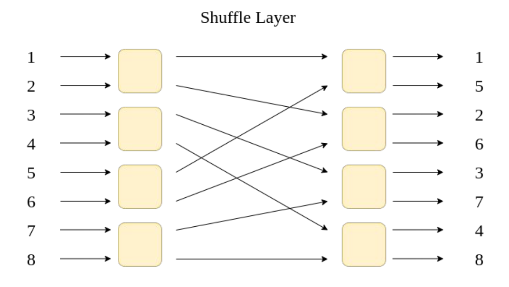
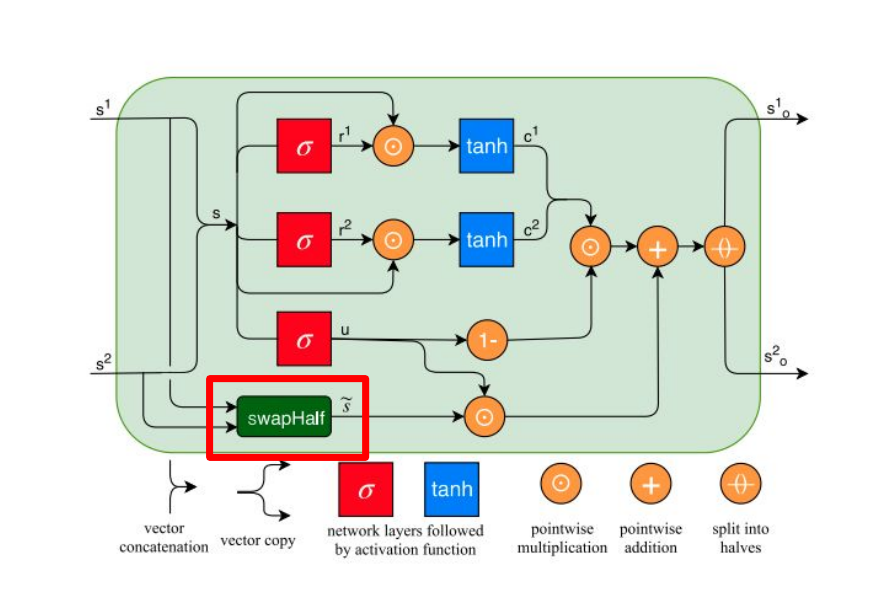
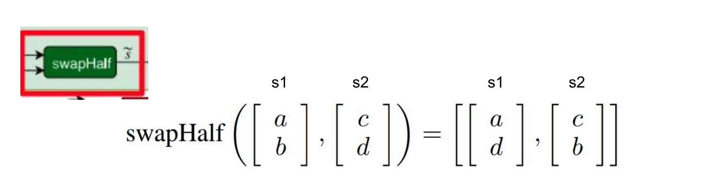
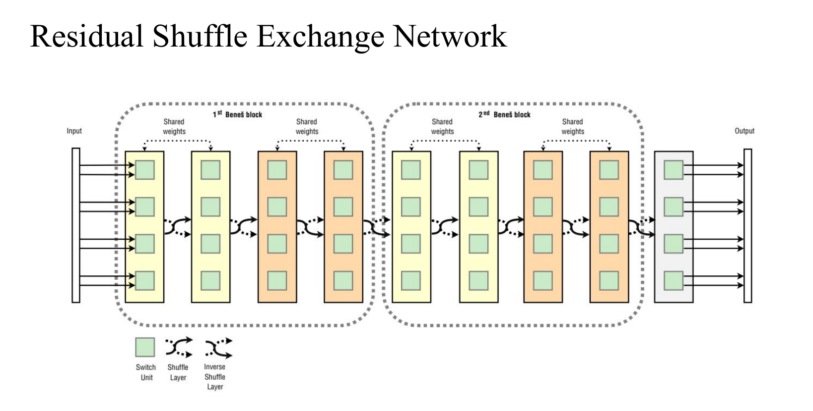

TechBeat 的报告和 FAIR 去年基于 transformer 实现目标检测的论文中都提及了 transformer 结构，于是今天我也来研究研究。

> 参考教程: 
>
> - [李宏毅老师 Transformer and its variant (由助教紀伯翰同學講授) ](https://www.bilibili.com/video/BV1ST4y1378R?from=search&seid=17310878830850294922)
> - [伯禹学堂《Attention is All You Need》论文解读]( https://www.boyuai.com/videos/10minspaper/o_6qAgqoWvE44v1rZVNlb )
> - [The Illustrated Transformer](http://jalammar.github.io/illustrated-transformer/)

# Transformer 基础

## Motivation: 变长数据建模

## Self Attention 自注意力机制 —— 完全不依赖循环或卷积结构，单纯依靠注意力机制进行建模的方法

注意力机制Attention(Q,K,V)具有三个向量Q、K、V，其中Q为输入，K、V为自有参数。它运作模式类似于Key-value数据库，即机制分析Query的组成部分，如果与某些Key匹配则将其所对应的value输出，最后组成注意力向量。注意力向量一般用作权重以表示模型看中某些符号而轻视某些符号。 

上图的流程：假设需要计算 e2 的输出，**将 e2 设置为 query，将其余 e1e3e4 设置为 key**，分别对其进行线性变换（矩阵K/Q），并计算内积，然后经过 softmax 层，就得到了对每个时刻输入（e1e3e4）的权重。再对其加权平均，经过前馈网络FFNN，得到输出 e2'。

> *我的问题：根号下 d_k 代表什么？*  回答：为了梯度的稳定，Transformer使用了score归一化 

## Multi-head Attention Module

> 本小节内容来自知乎: [为什么Transformer 需要进行 Multi-head Attention]( https://www.zhihu.com/question/341222779 )

Multi-head 类似于 CNN 的多个卷积核，不同的 head 负责不同的分工。原文是 "Multi-head attention allows the model to jointly attend to information from **different *representation subspaces*** at different positions."

Multi-head Attention好处在于可以从以下两个方面提升模型：

1. 允许模型focus在不同位置上，例如“苹果为什么受欢迎，因为它的系统好”，single-head attention去作用这句话，那么每个词embedding虽然含有其他词的embedding，但大部分是被词自身embedding所主导的，multi-head可以包含更多不同位置其他词的embedding，更有可能去发现文中的‘它’指代的是‘苹果’。
2. 每个head对应的QKV都是随机初始化的，那么在优化的过程，会将表征映射到更多的representation subspaces

实际应用中，num_heads作为超参，其数量的选择在不同数据集会有不同。

## Transformer 的编码/解码器结构

decoder 底端的自注意力层添加 mask: 由于 decoder 生成序列只能基于已有的序列，所以 self-attention 不能观察在该时刻之后的信息，于是 mask。

---

# 著名博客《The Illustrated Transformer》解读

编码组件是六层编码器首位相连堆砌而成，解码组件也是六层解码器堆成的。 最后一个编码器的输出将作为解码器自注意力模块的输入在六层解码器中反复横跳。

- The encoder’s inputs first flow through a self-attention layer – a layer that helps the encoder look at other words in the input sentence as it encodes a specific word.
- The decoder has both those layers, but between them is an attention layer that helps the decoder focus on relevant parts of the input sentence (similar what attention does in seq2seq models).

---

# Sandwich Transformer: Empirically 为 Transformer 的设计提供 insights

Motivation: Could we increase the performance just by reorder the sublayer module ?

## 实验结论

1. models with more self-attention toward the bottom and more feedforward sublayers toward the top tend to perform better in general.
2. No extra parameters, memory requirement.

---

# Universal Transformer: 解决演算法任务的通用Transformer结构

**Motivation: Transformer 在演算法任务上超烂，通用性差**

algorithmic task: 假设输入是abc，希望模型输出特定算法的pattern（比如输出的是复制三次的输入，即abcabcabc；或者reverse，即cba）。

- Transformer: Translation Good! / algorithmic task bad !

- Neural GPU: Translation Bad! / algorithmic task Good!

- Neural Turing Machine: Translation Bad! / algorithmic task Good!

## Method: 循环机制 + 动态Halt

- Weight sharing：CNN和RNN分别假设spatial translation invariace和time translation invariance，体现为CNN卷积核在空间上的权重共享和RNN单元在时间上的权重共享，所以universal transformer也增加了这种假设，使recurrent机制中的权重共享，在增加了模型表达力的同时更加接近rnn的inductive bias。
- Conditional computation：通过加入 ACT (动态Halt) 控制模型的计算次数，比固定depth的universal transformer取得了更好的结果
  - 在生成过程中，有些符号会比其他符号更难生成，例如人称代替“它”比专有名词”中国“难翻译的多，因此有必要在难生成的词语上倾注更多的计算资源。自适应计算时间(ACT)是动态调整每个输入输入符号处理次数的机制，模型在每一步中预测一个预计所需计算步长的标量。当某个位置“停止”后，它的隐状态直接拷贝到下一步，知道所有位置都停止。 

> 本小节内容来自：[Universal Transformers详解（知乎）]( https://zhuanlan.zhihu.com/p/44655133 )

---

# Residual Shuffle Exchange Network: Shuffle + Exchange 取代 Attention

perfect shuffle: 洗扑克牌

---

# BERT: B  E  R  T  永远滴神

