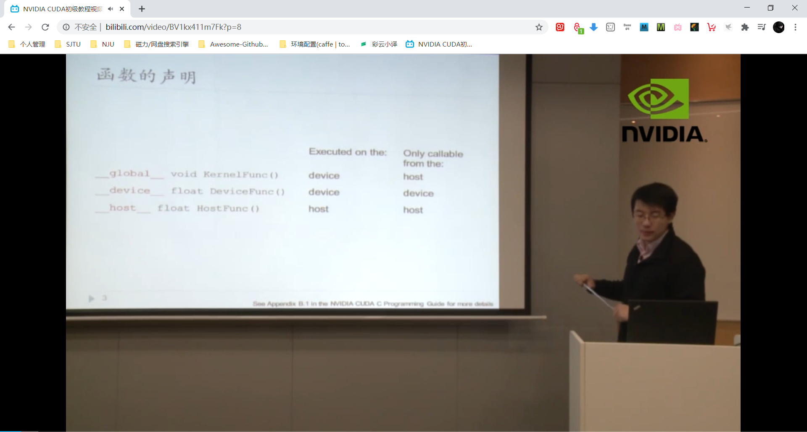
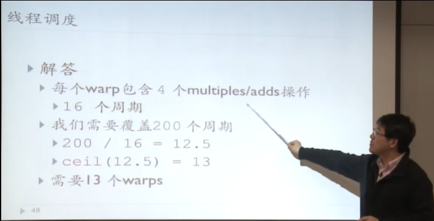

> 本节内容来自: [NVIDIA CUDA初级教程视频](https://www.bilibili.com/video/BV1kx411m7Fk?p=8)

主要内容：内置类型和函数，线程同步，线程调度，存储模型，重访，原子函数

如上图，global 函数只能在主机端调用，但是要在设备端执行。在异构计算架构中，GPU与CPU通过PCIe总线连接在一起来协同工作，CPU所在位置称为为主机端（host），而GPU所在位置称为设备端（device） 。函数的声明不一定唯一，这样的话函数在主机端和设备端可同时调用。

> 内联函数：？？？

线程同步可能导致死锁。

以下假设一个warp包含32个线程

Solution: 分批次处理（32个人吃饭但是饭桌只有8张桌子，4个周期调度完成）。但是现代架构中SP数远大于warp数了，不需要考虑分批次的问题了。

假定一次独立的M/A需要4个周期

每个线程的速度会增加，但是SM可承载的线程数受到了限制（办公桌面积增大，但是办公室能容纳的人数减少了）

